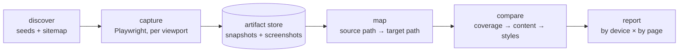
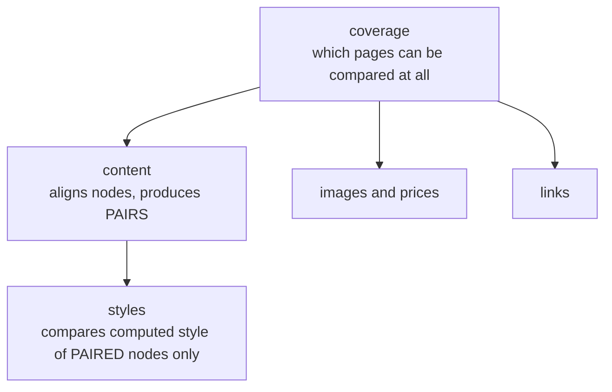
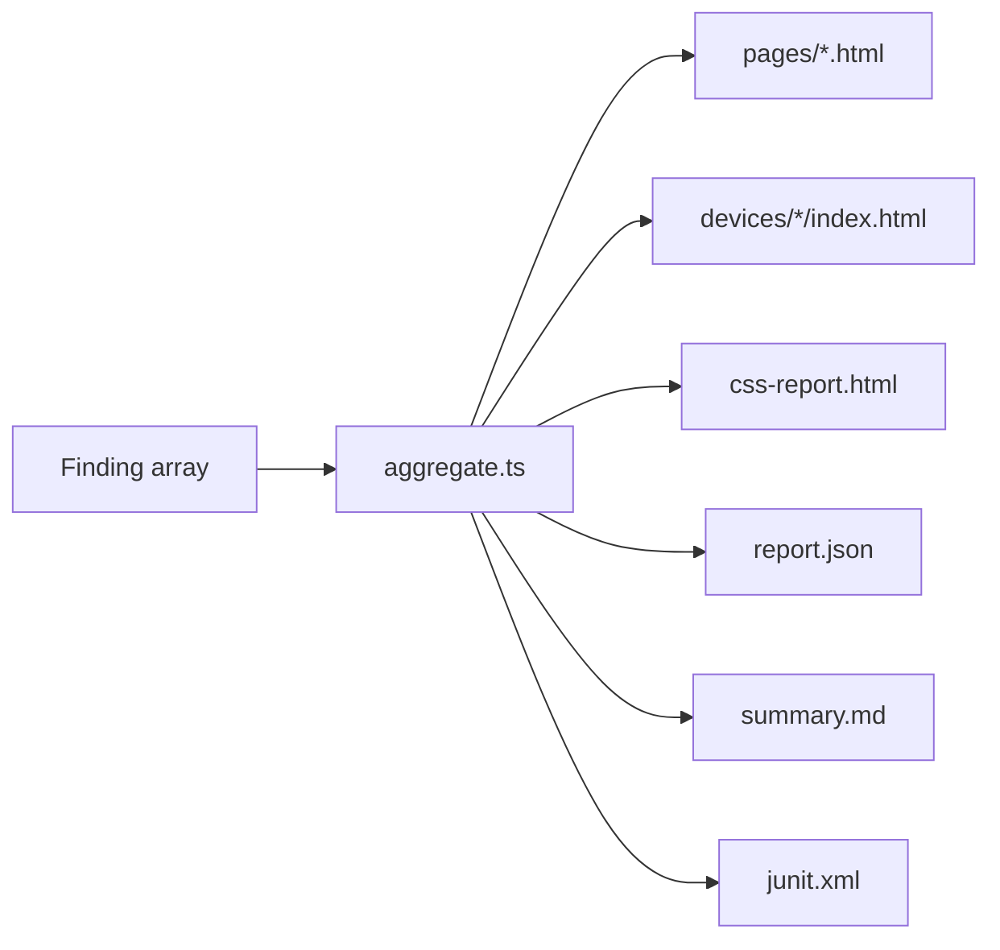

# Architecture

## The premise

The two sites share **no markup**. A legacy CMS emits tables and `sc-` classes;
a React rewrite emits semantic HTML and BEM. Any diff keyed on CSS selectors,
DOM structure or raw HTML therefore reports 100% drift on a _perfect_ migration.

Everything below follows from that.

## Pipeline



### Why capture and compare are decoupled

They communicate only through the on-disk store, never in memory.

Crawling is by far the slowest stage, and tuning ignore rules is inherently
iterative. Re-diffing a stored crawl takes seconds where re-crawling takes
twenty minutes, and that difference decides whether a team tunes the tool or
abandons it. It also lets CI crawl once and compare many times, and makes a run
reproducible after the fact.

```
drifter crawl     # slow, hits the network
drifter compare   # fast, pure computation — run this repeatedly
```

## Stage responsibilities

| Stage    | Module                        | Responsibility                                                      |
| -------- | ----------------------------- | ------------------------------------------------------------------- |
| discover | `src/crawl/frontier.ts`       | Bounds the crawl: origin, depth, revisits, traps                    |
| capture  | `src/crawl/crawler.ts`        | Renders each page at each viewport, stabilises it, extracts a model |
| store    | `src/store/artifact-store.ts` | Snapshots, screenshots, reports — one folder per run                |
| map      | `src/map/path-map.ts`         | Source path → target path, with overrides and rewrites              |
| compare  | `src/compare/engine.ts`       | Runs the comparators in dependency order                            |
| report   | `src/report/write.ts`         | Two navigation axes, JSON, Markdown, JUnit                          |

## Comparator ordering

Order is not arbitrary — each stage consumes the previous one's output.



**Styles never match elements themselves.** They compare only pairs that content
alignment already established. If the content pass could not confidently say two
elements are the same element, comparing their styles would attribute a
difference to the wrong thing — a confident, precise, wrong finding, which is
the most damaging kind this tool can produce.

## The Node / browser split

`src/extract/browser-extract.ts` is serialised and evaluated **inside the
browser**, so it must be self-contained: no imports, no closure over module
scope.

It does DOM work only. Everything requiring determinism happens in Node:

| In the browser                              | In Node                   |
| ------------------------------------------- | ------------------------- |
| Walking the DOM, reading landmarks          | Text normalisation        |
| `getComputedStyle`, `getBoundingClientRect` | Hashing and node identity |
| Visibility checks                           | Price parsing             |
| Finding images and price candidates         | URL canonicalisation      |

That split is what makes the hard parts unit-testable, and stops browser
behaviour or timing from leaking into a comparison.

> **The `__name` shim.** esbuild (via `tsx`) rewrites named functions to call an
> injected `__name` helper. That helper exists in the Node module scope but not
> in the page, so a serialised function dies with a `ReferenceError`.
> `bundlerShimInitScript` defines an identity `__name` in the page; removing it
> breaks every `page.evaluate`.

## Capture is per viewport, not per resize

Each page is loaded once per enabled viewport rather than being resized in
place. Resizing is several times faster, but it misses two real things:

1. Server-side device detection. A legacy CMS — Sitecore especially — may return
   entirely different markup for a mobile user agent.
2. Anything a page decides once, at load, based on width.

Viewport-independent data (content, links, images, prices, meta) is extracted
**once**, at the primary viewport. A paragraph either changed or it did not;
recording it four times would inflate every count fourfold.

## Where the reports come from



Every renderer reads the same aggregated model, so the two navigation axes and
the machine-readable output can never disagree about what was found.

## Further reading

- [Crawl boundaries](crawl-bounding.md) — origin, depth, revisits, traps
- [The artifact store](artifact-store.md) — run layout, disk cost, `keepSnapshots`
- [Report structure](reports.md) — the two axes, screenshots, statistics
- [Avoiding false positives](false-positives.md) — why the tool stays quiet
