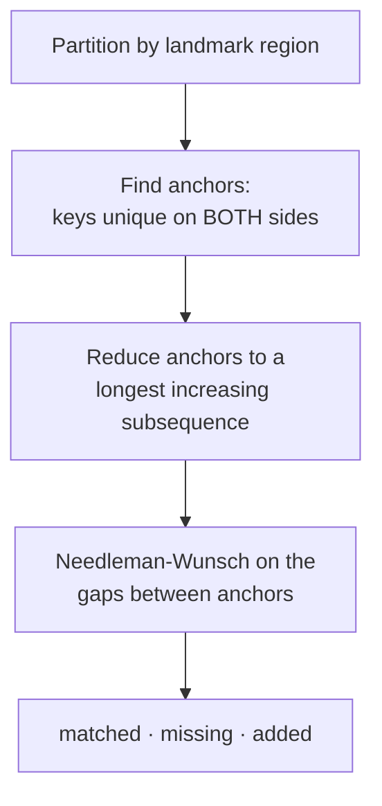

# The canonical page model

The single idea that makes this tool work: reduce **both** sites to the same
normalised, ordered stream of semantic nodes, and compare _that_.

## Why not compare the DOM

Consider the same navigation on two sides of a migration:

```html
<!-- legacy -->
<table class="sc-nav" role="navigation">
  <tr>
    <td><a href="/about">About us</a></td>
  </tr>
</table>

<!-- modern -->
<nav>
  <ul class="site-nav">
    <li class="site-nav__item"><a class="site-nav__link" href="/about">About us</a></li>
  </ul>
</nav>
```

Nothing matches: not the tags, not the classes, not the nesting depth. A DOM or
selector diff reports total drift. But the _content_ — a navigation link labelled
"About us" pointing at `/about` — is identical, and that is what a migration
team needs compared.

## The model

```ts
interface ContentNode {
  key: string;        // sha1(kindFamily + ':' + normalizedText)
  ordinal: number;    // disambiguates repeated identical nodes
  region: Region;     // header | nav | main | footer | aside | other
  kind: NodeKind;     // heading | paragraph | listItem | link | image | ...
  text: string;       // normalised
  attrs: {…};         // level, href→path, assetKey, alt, amount…
  selectorHint: string; // for the report ONLY — never used for matching
}
```

Both examples above reduce to the same node:

```
{ region: 'nav', kind: 'link', text: 'About us', attrs: { path: '/about' } }
```

### Kind families

`paragraph`, `listItem` and `tableCell` share one identity family, because
moving from table layout to semantic markup is the single most common change in
a legacy-to-modern migration. Without this, `<td>Name</td>` and
`<span>Name</span>` would never match and the entire body of every table-built
page would report as missing plus added.

Headings stay distinct (their level is meaningful), as do links, images and
controls, where the kind carries information the text does not.

### What is deliberately _not_ captured

A container whose text comes entirely from a child that is already a node.
`<td><a>Home</a></td>` would otherwise record "Home" twice — once as a cell,
once as a link — and with the two sides using different tags, every navigation
item would appear both missing _and_ added.

## Text normalisation

Applied before hashing, in Node, so it is deterministic and unit tested:

| Step                  | Removes                           |
| --------------------- | --------------------------------- |
| NFKC                  | Ligatures, full-width Latin       |
| Whitespace collapse   | Runs, NBSP, thin/narrow spaces    |
| Quote mapping         | `“ ” ‘ ’ ′ ″` → `" '`             |
| Dash mapping          | `‐ – — −` → `-`                   |
| Invisible stripping   | Zero-width, soft hyphen, BOM      |
| `ignore.textPatterns` | Timestamps, counters, session ids |

Punctuation and case are **kept** — they carry meaning, and losing them would
hide real content drift.

> Ignore patterns are recompiled on every call. A shared `/g` regex carries
> `lastIndex` between calls, which would make normalisation depend on call order
> and silently skip matches on alternate pages.

## Matching: anchored alignment

Two ordered streams, where a node may have been edited, moved, deleted or
inserted. Which source node corresponds to which target node?



### 1. Partition by region

A footer paragraph is never a candidate for a body paragraph, however similar
the words. A plausible-looking wrong match is worse than no match.

### 2. Anchor on unique keys

A heading that appears exactly once on each page is the same heading, wherever
it sits. Requiring uniqueness is what makes an anchor trustworthy — a key
appearing three times ("Read more") says nothing about which instance is which,
so those are left to the similarity pass.

Anchors are then reduced to a longest increasing subsequence so they cannot
cross. Anchors that _would_ cross are genuinely moved content, and dropping them
keeps the largest consistent skeleton.

### 3. Align the gaps

Needleman–Wunsch between consecutive anchors, scored by trigram Dice similarity.

**Why not run Needleman–Wunsch over the whole page?** It is O(n·m) — 640,000
cells for an 800-node page, which is tolerable once and ruinous across a
thousand pages and four viewports. Anchoring reduces it to a handful of small
quadratic problems, and is near-linear on pages that mostly match, which is the
normal case for a migration.

**Gaps cost nothing.** Penalising them would push the alignment into pairing
unrelated nodes just to avoid a gap, producing confident nonsense. Deletions and
insertions are exactly what we want reported.

### 4. Similarity

```
different family                       → 0     (never matched)
identical text                         → 1.0
same family, Dice(trigrams) ≥ threshold→ 0.5–0.99
link: text × 0.75 + 0.25 if same path
heading at a different level: text × 0.9
same family, different tag: text × 0.98
```

Pairs scoring below `thresholds.textSimilarity` are reported as **separate**
missing and added findings, never as a bogus "drift" between two unrelated
nodes.

## Output

| Alignment result      | Finding                                |
| --------------------- | -------------------------------------- |
| matched, text differs | `content.drift`                        |
| source only           | `content.missing`                      |
| target only           | `content.added`                        |
| matched, identical    | _(nothing — and this is most of them)_ |

Every finding carries the match `confidence`, so a reviewer can discount one
built on a weak pairing rather than having to guess why two nodes were compared.

The matched pairs are then handed to the CSS comparator, which never matches
elements itself. See [CSS comparison](css-comparison.md).
